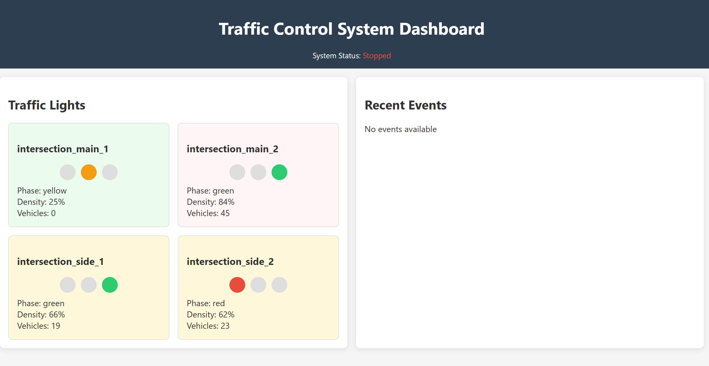

# Traffic Control System


A comprehensive, intelligent traffic control system that uses computer vision and machine learning to optimize traffic flow, reduce congestion, and improve urban transportation.

## 🎬 Demo



[Watch the demo video](video.mp4)

## 📋 Overview

The Traffic Control System is a modular solution designed to manage traffic lights efficiently by analyzing real-time traffic conditions. It employs computer vision for vehicle detection, machine learning for traffic prediction, and inter-traffic light communication for coordinated traffic management.

### 🚀 Key Features

- **Vehicle Detection**: Uses computer vision to detect and count vehicles in real-time
- **Traffic Density Analysis**: Calculates traffic density and congestion levels
- **Dynamic Traffic Light Control**: Adjusts signal timing based on current traffic conditions
- **Green Wave Coordination**: Creates coordinated "green waves" for improved traffic flow
- **Emergency Vehicle Priority**: Automatically creates green corridors for emergency vehicles
- **Public Transport Integration**: Gives buses and trams priority at intersections
- **Pedestrian Safety**: Responsive to pedestrian crossing requests
- **Weather Integration**: Adjusts traffic patterns based on weather conditions
- **Machine Learning Prediction**: Predicts traffic patterns using historical data
- **Interactive Dashboard**: Web-based visualization of traffic data and statistics
- **Simulation Mode**: Test the system without physical hardware

## 🔍 System Architecture

```
┌────────────────────────────────────────────────────────────────────┐
│                          System Integrator                          │
└───────────────────────────┬────────────────────────────────────────┘
                                │
                                ▼
┌────────────────────────────────────────────────────────────────────┐
│                           Event Manager                             │
└───────┬─────────┬──────────┬─────────┬───────────┬─────────┬───────┘
        │         │          │         │           │         │
        ▼         ▼          ▼         ▼           ▼         ▼
┌──────────┐ ┌─────────┐ ┌────────┐ ┌────────┐ ┌────────┐ ┌────────┐
│Green Wave│ │Emergency│ │ Public │ │Pedestr.│ │Weather │ │  V2I   │
│Controller│ │ Control │ │Transp. │ │Control │ │Control │ │Control │
└──────────┘ └─────────┘ └────────┘ └────────┘ └────────┘ └────────┘
        │         │          │         │           │         │
        └─────────┴──────────┴─────────┴───────────┴─────────┘
                                │
                                ▼
┌──────────┐ ┌─────────┐ ┌────────────┐ ┌────────────┐ ┌───────────┐
│ ML Pred. │ │Analytics│ │ Dashboard  │ │Event Logger│ │Simulation │
│Controller│ │ Control │ │ Controller │ │ Controller │ │Controller │
└──────────┘ └─────────┘ └────────────┘ └────────────┘ └───────────┘
```

## 💻 Installation

### Prerequisites

- Python 3.8 or higher
- Git (optional, for cloning the repository)

### Setup

#### 1. Clone the repository

```bash
git clone https://github.com/ErfanZohrabi/traffic-control-system.git
cd traffic-control-system
```

#### 2. Create a virtual environment (recommended)

```bash
# Linux/macOS
python -m venv venv
source venv/bin/activate

# Windows
python -m venv venv
.\venv\Scripts\activate
```

#### 3. Install dependencies

```bash
pip install -r requirements.txt
pip install -e .
```

#### 4. Fix common issues (recommended)

We've created a script that automatically fixes common issues:

```bash
python fix_traffic_system.py
```

## 🚦 Running the System

### Option 1: Run the Simple Demo (Best for Windows users)

We've created a simplified demo that works without TensorFlow or OpenCV:

```bash
python simple_demo.py
```

This will:
- Start the traffic control system
- Simulate traffic patterns for 30 seconds
- Display events in the console

### Option 2: Run the Dashboard (Recommended for Linux/Mac Users)

The dashboard provides a visual interface to monitor the traffic system:

```bash
python test_dashboard.py
```

This will:
- Start the traffic control system
- Launch a web dashboard at http://localhost:8080
- Simulate traffic patterns for demonstration

### Option 3: Full Simulation Demo

For a comprehensive demo of all traffic control features:

```bash
python demo.py
```

### Option 4: Minimal System Test

For a quick test of the core functionality:

```bash
python test_minimal.py
```

### Option 5: API Test

To test the RESTful API for external system integration:

```bash
python test_api.py
```

### Windows-Specific Instructions

For Windows users, we've created helper scripts:

```powershell
# Using PowerShell
.\run_traffic.ps1

# Or using batch files
.\run_dashboard.bat
.\run_demo.bat
```

See [WINDOWS_SETUP.md](WINDOWS_SETUP.md) for detailed Windows setup instructions.

## 📚 Modules

| Module | Description |
|--------|-------------|
| **Green Wave** | Creates coordinated traffic light timing for smooth traffic flow |
| **Emergency** | Prioritizes emergency vehicles through intersections |
| **Public Transport** | Gives priority to buses, trams, and other public transit |
| **Pedestrian** | Manages pedestrian crossings and safety features |
| **Weather** | Integrates weather data to adjust traffic patterns |
| **Analytics** | Collects and analyzes traffic data for insights |
| **Mobile App** | Provides integration with mobile applications |
| **ML Prediction** | Uses machine learning to predict traffic patterns |
| **Dashboard** | Web-based visualization and control interface |
| **V2I** | Vehicle-to-Infrastructure communication |
| **Event Logger** | Records and analyzes system events |
| **Simulation** | Simulates traffic patterns for testing |

## 🔧 Configuration

The system can be configured using JSON or YAML files:

```bash
# Export default configuration
python main.py --export-config config.yaml

# Run with custom configuration
python main.py --config config.yaml
```

## 🔍 Troubleshooting

### Common Issues

- **ModuleNotFoundError**: Make sure you've installed the package in development mode with `pip install -e .`
- **Address already in use**: Another process is using port 8080, modify the dashboard port or close the other application
- **TensorFlow Import Error**: Make sure TensorFlow is installed with `pip install tensorflow`
- **System exits immediately**: Check logs in the `logs/` directory for error messages

For Windows-specific issues, see [WINDOWS_SETUP.md](WINDOWS_SETUP.md).

## 📝 License

This project is licensed under the MIT License - see the LICENSE file for details.

## 🤝 Contributing

Contributions are welcome! Please feel free to submit a Pull Request.

1. Fork the repository
2. Create your feature branch (`git checkout -b feature/amazing-feature`)
3. Commit your changes (`git commit -m 'Add some amazing feature'`)
4. Push to the branch (`git push origin feature/amazing-feature`)
5. Open a Pull Request

## 📞 Contact

For any inquiries, please contact [erfanzohrabi.ez@gmail.com](mailto:erfanzohrabi.ez@gmail.com).

## 👨‍💻 Author

**Erfan Zohrabi**
- GitHub: [ErfanZohrabi](https://github.com/ErfanZohrabi)
- LinkedIn: [in/erfan-zohrabi](https://www.linkedin.com/in/erfan-zohrabi/) 